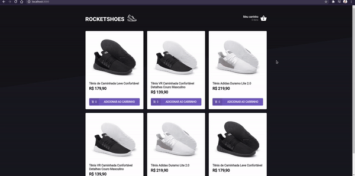

# desafio-03-ignite-reactjs

In this challenge React concepts create an application to train what I have learned so far , This will be an application where your main goal is to create a shopping cart hook.


<h1 align="center">
    
</h1>

<br>

##### Application developed In this challenge React concepts create an application to train what I have learned so far , 
This will be an application where your main goal is to create a shopping cart hook. We will have access to two pages, a component, and a hook to implement the functionality requested in this challenge:
- Add a new product to the cart;
- Remove a product from your cart;
- Changing the quantity of a product in the cart;
- Calculating the sub-total and total prices of the cart;
- Validation of stock;
- Display error messages; 
- Among others.

## 🧪 Technologies

Application developed using the following technologies:

- [React](https://reactjs.org)
- [TypeScript](https://www.typescriptlang.org/)
- [Styled-components](https://styled-components.com/)
- [React-toastify](https://fkhadra.github.io/react-toastify/introduction)
- [React-icons](https://react-icons.github.io/react-icons/)
- [React-router-dom](https://reactrouter.com/web/guides/quick-start)
- [Polished](https://polished.js.org/)
- [Axios](https://github.com/axios/axios)
- [Json-server](https://github.com/typicode/json-server)

## 🚀 Getting started

### Requirements

- You need to install both [Node.js](https://nodejs.org/en/download/) and [Yarn](https://yarnpkg.com/) to run this project.

Clone the project and access the folder.

```bash
$ git clone https://github.com/felipe-gomes-vicente/desafio-03-ignite-reactjs.git
$ cd desafio-03-ignite-reactjs
```

Follow the steps below:
```bash
# Install the dependencies
$ yarn


Fake API with JSON Server
# Start the server
$ yarn server

# Start the project
$ yarn start
```
The app will be available for access on your browser at http://localhost:3000
Server Home
http://localhost:3333
The app will be available for access on your server at http://localhost:3333
To load server
http://localhost:3333/stock
http://localhost:3333/products

## 📝 License

This project is licensed under the MIT License. See the [LICENSE](LICENSE.md) file for details.


---

<p align="center">Made with 💜 by Felipe Vicente👋</p>  

- ## My LinkedIn - [](https://www.linkedin.com/in/felipe-gomes-vicente/) 
